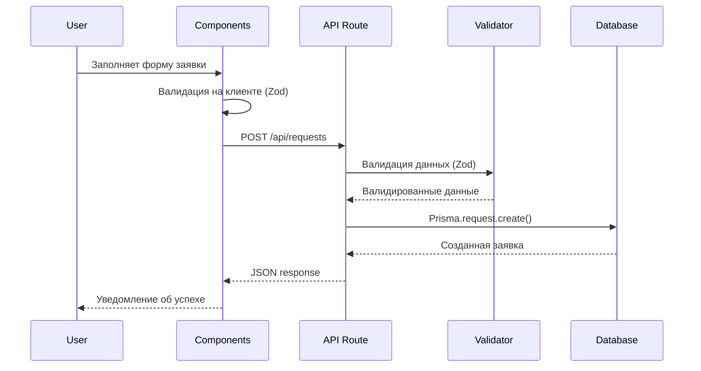
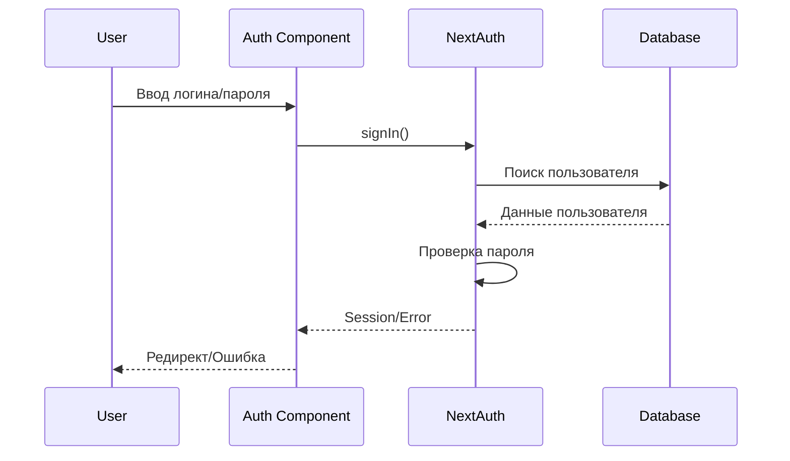
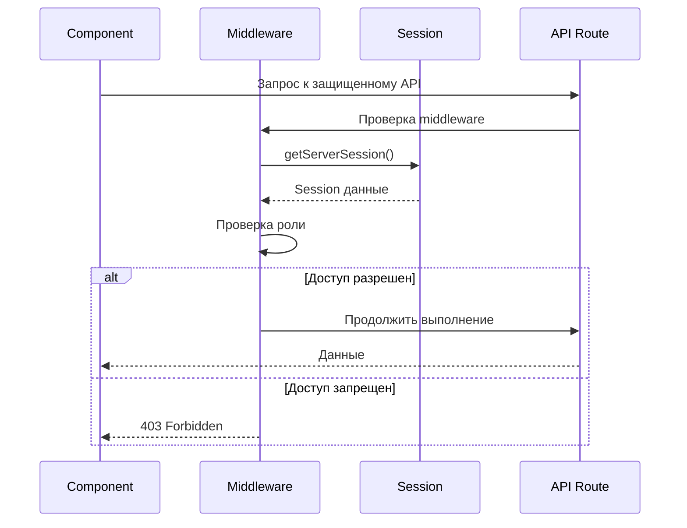

# Архитектура системы

Этот документ описывает техническую архитектуру Project OD, включая структуру компонентов, потоки данных и принципы проектирования.

## Обзор архитектуры

Project OD построен с использованием современного full-stack подхода на базе Next.js, обеспечивающего как серверную, так и клиентскую части приложения в едином проекте.

### Архитектурная диаграмма

```
┌─────────────────┐    ┌─────────────────┐    ┌─────────────────┐
│   Пользователь  │    │     Admin       │    │   Dispatcher    │
│    (Browser)    │    │   (Browser)     │    │   (Browser)     │
└─────────┬───────┘    └─────────┬───────┘    └─────────┬───────┘
          │                      │                      │
          └──────────────────────┼──────────────────────┘
                                 │
                    ┌─────────────┴─────────────┐
                    │      Load Balancer        │
                    │      (Nginx/Vercel)       │
                    └─────────────┬─────────────┘
                                 │
                    ┌─────────────┴─────────────┐
                    │      Next.js App          │
                    │   (Frontend + Backend)    │
                    │                           │
                    │  ┌─────────────────────┐  │
                    │  │   App Router        │  │
                    │  │   /app/             │  │
                    │  └─────────────────────┘  │
                    │                           │
                    │  ┌─────────────────────┐  │
                    │  │   API Routes        │  │
                    │  │   /app/api/         │  │
                    │  └─────────────────────┘  │
                    │                           │
                    │  ┌─────────────────────┐  │
                    │  │   Components        │  │
                    │  │   /components/      │  │
                    │  └─────────────────────┘  │
                    └─────────────┬─────────────┘
                                 │
                    ┌─────────────┴─────────────┐
                    │     Authentication        │
                    │      (NextAuth.js)        │
                    └─────────────┬─────────────┘
                                 │
                    ┌─────────────┴─────────────┐
                    │      Prisma ORM           │
                    │    (Data Layer)           │
                    └─────────────┬─────────────┘
                                 │
                    ┌─────────────┴─────────────┐
                    │      PostgreSQL           │
                    │      (Database)           │
                    └───────────────────────────┘
```

## Слои архитектуры

### 1. Презентационный слой (Presentation Layer)

**Расположение**: `/app/`, `/components/`

**Ответственность**:

- Отображение пользовательского интерфейса
- Обработка пользовательского ввода
- Управление локальным состоянием
- Валидация форм на клиенте

**Технологии**:

- React 19 с Server Components
- TypeScript для типизации
- Tailwind CSS для стилизации
- Radix UI для базовых компонентов
- React Hook Form + Zod для работы с формами

**Структура**:

```
app/
├── (auth)/           # Группа маршрутов для аутентификации
├── admin/            # Административная панель
├── profile/          # Профиль пользователя
├── requests/         # Управление заявками
├── layout.tsx        # Корневой layout
├── page.tsx          # Главная страница
└── globals.css       # Глобальные стили

components/
├── ui/               # Базовые UI компоненты
├── providers/        # React Context провайдеры
├── admin-*           # Компоненты админ панели
├── request-*         # Компоненты для работы с заявками
└── user-*            # Компоненты для работы с пользователями
```

### 2. Слой бизнес-логики (Business Logic Layer)

**Расположение**: `/app/api/`, `/lib/`

**Ответственность**:

- Реализация бизнес-правил
- Обработка API запросов
- Валидация данных на сервере
- Аутентификация и авторизация

**Технологии**:

- Next.js API Routes
- NextAuth.js для аутентификации
- Zod для валидации данных
- bcryptjs для хеширования паролей

**Структура API**:

```
app/api/
├── auth/
│   ├── [...nextauth]/    # NextAuth конфигурация
│   ├── login/           # Вход в систему
│   └── register/        # Регистрация
├── admin/
│   └── users/           # Управление пользователями
├── requests/            # CRUD операции с заявками
├── messages/            # Сообщения к заявкам
└── profile/             # Профиль пользователя
```

### 3. Слой доступа к данным (Data Access Layer)

**Расположение**: `/lib/db-clients/`, `/lib/db.ts`

**Ответственность**:

- Взаимодействие с базой данных
- Выполнение запросов и мутаций
- Кеширование данных
- Обработка ошибок БД

**Технологии**:

- Prisma ORM
- PostgreSQL
- Connection pooling

**Структура**:

```
lib/
├── db.ts                    # Подключение к БД
├── db-clients/
│   └── requests.client.ts   # Клиент для работы с заявками
└── validators/              # Схемы валидации Zod
```

### 4. Слой данных (Data Layer)

**Расположение**: `/prisma/`

**Ответственность**:

- Схема базы данных
- Миграции
- Seed данные
- Генерация типов

**Технологии**:

- PostgreSQL 12+
- Prisma Schema Language

## Потоки данных

### 1. Поток создания заявки



### 2. Поток аутентификации



### 3. Поток авторизации



## Компоненты системы

### 1. Система аутентификации

**Архитектура**: Session-based с использованием NextAuth.js

**Компоненты**:

- `SessionProvider` - React контекст для сессии
- `middleware.ts` - Защита маршрутов
- `auth-options.ts` - Конфигурация NextAuth
- `get-session-user.ts` - Утилита получения пользователя

**Поток работы**:

1. Пользователь вводит учетные данные
2. NextAuth проверяет данные в БД
3. Создается зашифрованная сессия в cookies
4. Последующие запросы используют сессию для авторизации

### 2. Система управления заявками

**Архитектура**: CRUD операции с валидацией и авторизацией

**Компоненты**:

- `RequestForm` - Форма создания/редактирования
- `RequestsList` - Список заявок с фильтрацией
- `RequestDetails` - Детальный просмотр заявки
- `RequestActions` - Действия над заявкой

**Состояния заявки**:

```
CREATED → COMPLETED
   ↓
INCORRECT
```

**Права доступа**:

- ADMIN: полный доступ
- MANAGER: просмотр всех, редактирование статуса
- DISPATCHER: создание, просмотр своих

### 3. Система сообщений

**Архитектура**: Связанные с заявками сообщения

**Компоненты**:

- `MessagesForm` - Форма отправки сообщения
- `Messages` - Список сообщений

**Особенности**:

- Сообщения привязаны к конкретной заявке
- Время создания отображается в локальной временной зоне
- Удаление заявки каскадно удаляет сообщения

### 4. Административная панель

**Архитектура**: RBAC (Role-Based Access Control)

**Компоненты**:

- `AdminUsersList` - Управление пользователями
- `UserListItem` - Элемент списка пользователей

**Функциональность**:

- Просмотр всех пользователей
- Редактирование ролей
- Удаление пользователей (кроме себя)

## Принципы проектирования

### 1. Separation of Concerns

Каждый компонент и слой имеет четко определенную ответственность:

```typescript
// Компонент отвечает только за UI
function RequestForm({ onSubmit }: Props) {
  // Только логика UI
}

// Хук отвечает за бизнес-логику
function useCreateRequest() {
  // Только логика создания заявки
}

// API маршрут отвечает за обработку HTTP
export async function POST(request: NextRequest) {
  // Только обработка HTTP запроса
}
```

### 2. Type Safety

Строгая типизация на всех уровнях:

```typescript
// Prisma генерирует типы из схемы БД
import { Request, User } from '@/generated/prisma-client'

// Zod схемы для валидации и генерации типов
const CreateRequestSchema = z.object({
  type: z.enum(['ONE_DAY_DELIVERY', 'CORRECTION_SALE']),
  // ...
})

type CreateRequestData = z.infer<typeof CreateRequestSchema>
```

### 3. Single Source of Truth

База данных как единственный источник истины:

```typescript
// Типы генерируются из Prisma схемы
// Валидация основана на ограничениях БД
// API следует структуре данных БД
```

### 4. Progressive Enhancement

Приложение работает с отключенным JavaScript:

```typescript
// Формы используют server actions
export async function createRequestAction(formData: FormData) {
  // Серверная обработка формы
}

// Client-side улучшения добавляются поверх
function RequestForm() {
  // React Hook Form для лучшего UX
}
```

## Безопасность

### 1. Аутентификация

```typescript
// Хеширование паролей
const hashedPassword = await bcrypt.hash(password, 10)

// Проверка паролей
const isValid = await bcrypt.compare(password, hashedPassword)

// Сессии с истечением
const session = {
  user: { id, username, role },
  expires: new Date(Date.now() + 30 * 24 * 60 * 60 * 1000), // 30 дней
}
```

### 2. Авторизация

```typescript
// Middleware для защиты маршрутов
export function middleware(request: NextRequest) {
  const token = request.nextauth.token

  if (!token) {
    return NextResponse.redirect('/auth/login')
  }

  // Проверка прав доступа к админ панели
  if (request.nextUrl.pathname.startsWith('/admin')) {
    if (token.role !== 'ADMIN') {
      return NextResponse.redirect('/')
    }
  }
}
```

### 3. Валидация данных

```typescript
// Валидация на всех уровнях
export async function POST(request: NextRequest) {
  // 1. Проверка аутентификации
  const user = await getSessionUser()
  if (!user) {
    return NextResponse.json({ error: 'Unauthorized' }, { status: 401 })
  }

  // 2. Валидация входных данных
  const body = await request.json()
  const validatedData = CreateRequestSchema.parse(body)

  // 3. Проверка бизнес-правил
  if (validatedData.type === 'URGENT' && user.role !== 'ADMIN') {
    return NextResponse.json({ error: 'Forbidden' }, { status: 403 })
  }

  // 4. Безопасное создание записи
  const request = await db.request.create({
    data: {
      ...validatedData,
      userId: user.id, // Используем ID из сессии
    },
  })
}
```

### 4. Защита от атак

```typescript
// CSRF защита через NextAuth
// XSS защита через Content Security Policy
// SQL Injection защита через Prisma prepared statements
// Rate limiting в production
```

## Производительность

### 1. Server-Side Rendering

```typescript
// Страницы рендерятся на сервере
export default async function RequestsPage() {
  const requests = await db.request.findMany();

  return <RequestsList initialData={requests} />;
}
```

### 2. Статическая генерация

```typescript
// Статические страницы для лучшей производительности
export async function generateStaticParams() {
  return [{ locale: 'ru' }, { locale: 'en' }]
}
```

### 3. Кеширование

```typescript
// Кеширование на уровне БД
const requests = await db.request.findMany({
  // Prisma автоматически кеширует идентичные запросы
})

// Кеширование на уровне Next.js
export const revalidate = 3600 // 1 час
```

### 4. Оптимизация запросов

```typescript
// Включение связанных данных одним запросом
const requestWithUser = await db.request.findUnique({
  where: { id },
  include: {
    user: {
      select: { id: true, username: true, name: true, surname: true },
    },
    messages: {
      include: {
        user: {
          select: { username: true, name: true, surname: true },
        },
      },
    },
  },
})
```

## Масштабируемость

### 1. Горизонтальное масштабирование

```typescript
// Stateless архитектура
// Сессии в базе данных (не в памяти)
// Load balancing через Nginx/Vercel
```

### 2. Вертикальное масштабирование

```typescript
// Connection pooling в Prisma
// Кластеризация Node.js процессов через PM2
// Оптимизация запросов к БД
```

### 3. Микросервисная готовность

```typescript
// Четкое разделение API маршрутов
// Независимые модули (auth, requests, messages)
// Возможность выделения в отдельные сервисы
```

## Мониторинг и логирование

### 1. Структурированное логирование

```typescript
// Логирование с контекстом
logger.info('Request created', {
  requestId: request.id,
  userId: user.id,
  type: request.type,
  timestamp: new Date().toISOString(),
})
```

### 2. Метрики производительности

```typescript
// Измерение времени выполнения
console.time('database-query')
const result = await db.request.findMany()
console.timeEnd('database-query')
```

### 3. Health checks

```typescript
// API для проверки здоровья системы
export async function GET() {
  try {
    await db.$queryRaw`SELECT 1`
    return NextResponse.json({ status: 'healthy' })
  } catch (error) {
    return NextResponse.json({ status: 'unhealthy' }, { status: 503 })
  }
}
```

## Тестирование

### 1. Архитектура тестирования

```
tests/
├── unit/           # Модульные тесты
├── integration/    # Интеграционные тесты
├── e2e/           # End-to-end тесты
└── fixtures/      # Тестовые данные
```

### 2. Тестирование компонентов

```typescript
// Изолированное тестирование компонентов
import { render, screen } from '@testing-library/react';
import { RequestForm } from '../RequestForm';

test('отображает форму создания заявки', () => {
  render(<RequestForm onSubmit={jest.fn()} />);
  expect(screen.getByLabelText('Тип заявки')).toBeInTheDocument();
});
```

### 3. Тестирование API

```typescript
// Тестирование API маршрутов
import { createMocks } from 'node-mocks-http'
import handler from '../api/requests/route'

test('создает новую заявку', async () => {
  const { req, res } = createMocks({
    method: 'POST',
    body: { type: 'ONE_DAY_DELIVERY', warehouse: 'Test' },
  })

  await handler(req, res)
  expect(res._getStatusCode()).toBe(201)
})
```

Эта архитектура обеспечивает масштабируемость, безопасность и производительность Project OD, следуя современным практикам разработки full-stack приложений.
